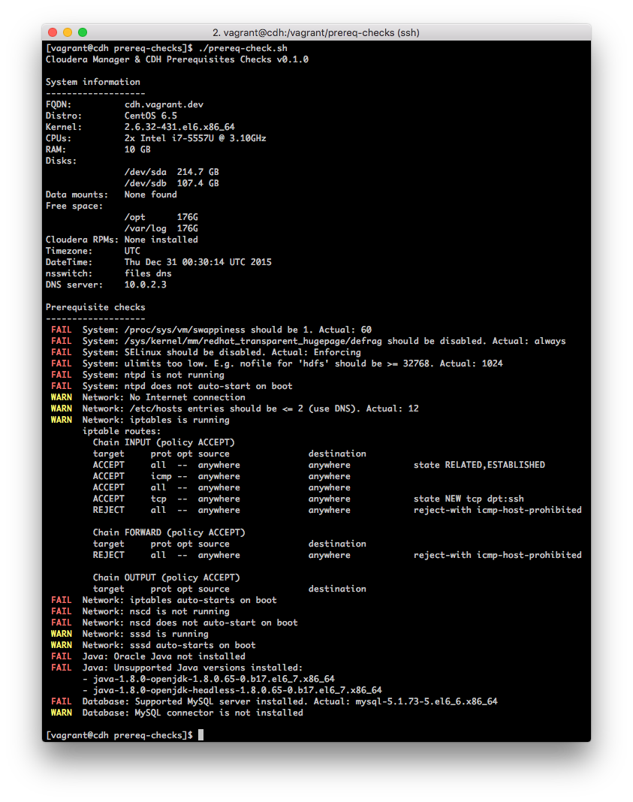
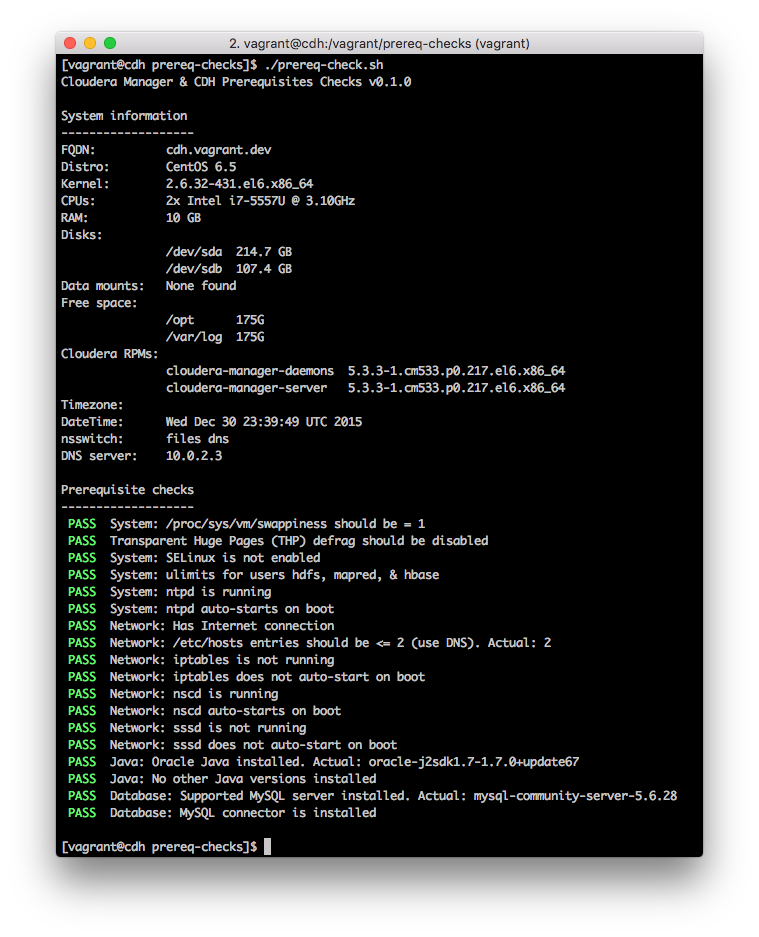

# CM & CDH Prerequisites Checker

Bash script for displaying relevant system information and performing
prerequisite checks for Cloudera Manager & CDH installation.

Motivation: Ensuring that the long list of required and recommended
prerequisites are correctly applied during a [Hadoop Cluster
Certification](http://www.cloudera.com/content/www/en-us/services-support/professional-services/cluster-certification.html)
(or similar) engagement is manual, time-consuming, and error-prone (not to
mention mind-numbing).

Non-Goals: This is not intended to replace or compete with
[CSI](http://csi.cloudera.com).  Once Cloudera Manager is installed, use the
"Validation Overview" tab in CSI instead. For example, [Singtel's Validation
Overview](https://csi.cloudera.com/synergy/validation/customer/?embed=&globalCustomerKey=463eed9a-ecad-4413-ae1f-4cb68063e9cc&customerKey=).

For details on the checks performed, refer to the following:
- [Installation requirements for Cloudera Manager & CDH](http://www.cloudera.com/content/www/en-us/documentation/enterprise/latest/topics/installation_reqts.html)
- [Optimizing Performance in CDH](http://www.cloudera.com/content/www/en-us/documentation/enterprise/latest/topics/cdh_admin_performance.html)

## Sample output

The following screenshot shows a run on an unconfigured (or misconfigured)
system:

And here's the output on the same server after addressing all the issues:

## Running it

Running the script is easy as it is intentionally written in Bash to avoid any
dependencies. This is to avoid dependency hell in restrictive customer
environments.

Note that it does not run on Mac OS and has only been tested on RHEL/CentOS 6.5
so far. Your Mileage May Vary.

It requires root/superuser permissions for some commands.

First check out the repository and switch into the newly created directory:

    git clone http://github.mtv.cloudera.com/jtan/prereq-checks.git
    cd prereq-checks

### Option A

Simply execute the script:

    ./prereq-check.sh

It requires the libraries in `lib/`, as breaking down the code into several
files makes them easier to maintain. If you rather copy around a single file
instead, use Option B.

### Option B

To build the single file version of the script, run:

    ./build-single.sh

This produces the file `prereq-check-single.sh`, which is the exact same code just with all the libs concatenated into a single file so it's easier to handle. Simply execute it like in Option A:

    ./prereq-check-single.sh

## Roadmap

Some items on the roadmap:

- More checks (e.g. hostname and DNS resolution)
- Check a list of servers instead of just localhost

## Contributions

Please report any bugs or feature requests using the Github Issues here. Better yet, send pull requests! For everything else, contact James Tan via <jtan@cloudera.com>.
